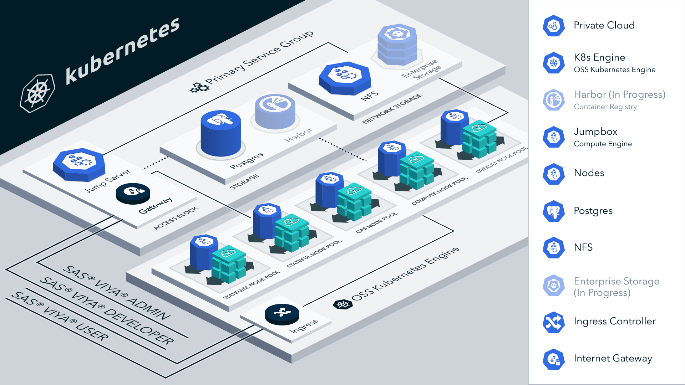

# SAS Viya 4 Infrastructure as Code (IaC) for Open Source Kubernetes

## Release Notes

- A problem with the implementation of the default storage class and its usage of an NFS server as its
backing store has been addressed with [this issue](https://github.com/sassoftware/viya4-iac-k8s/issues/6).

## Overview

This project helps you to automate the cluster-provisioning phase of SAS Viya deployment. It contains Terraform scripts to provision cloud infrastructure resources for VMware, and it contains Ansible files to apply the elements of a Kubernetes cluster that are required to deploy SAS Viya 4 product offerings. Here is a list of resources that this project can create:

>- An open source [Kubernetes](https://kubernetes.io/docs/setup/production-environment/tools/kubeadm/) cluster with the following components:
  >>- Container Runtime Interface (CRI): [containerd](https://kubernetes.io/docs/setup/production-environment/container-runtimes/#containerd), [Docker](https://kubernetes.io/docs/setup/production-environment/container-runtimes/#docker), and [cri-o](https://kubernetes.io/docs/setup/production-environment/container-runtimes/#cri-o) [not ready]
  >>- Container Network Interface (CNI): [Calico](https://kubernetes.io/docs/concepts/cluster-administration/networking/#calico)
  >>- Cluster-level virtual IP address (VIP): [kube-vip](https://kube-vip.io/)
  >>- Cloud controller manager: [kube-vip](https://kube-vip.io/docs/usage/cloud-provider/)
>- Nodes with required labels and taints
>- Infrastructure to deploy the SAS Viya CAS server in SMP or MPP mode

[](./docs/images/viya4-iac-k8s-diag.png?raw=true)

To learn about all phases and options of the SAS Viya deployment process, see [Getting Started with SAS Viya and Open Source Kubernetes](https://go.documentation.sas.com/doc/en/itopscdc/default/itopscon/p1qungdpndaksyn156ng6duptma0.htm?fromDefault=) in _SAS&reg; Viya&reg; Operations_.

Once the resources are provisioned, use the [viya4-deployment](https://github.com/sassoftware/viya4-deployment) project to deploy SAS Viya in your cloud environment. For more information about SAS Viya requirements and documentation for the deployment process, refer to the [SAS Viya Operations Guide](https://go.documentation.sas.com/doc/en/itopscdc/default/itopswn/titlepage.htm).

This project supports infrastructure that is built on **physical machines** ("bare metal" machines or Linux VMs) or on **VMware vSphere or vCenter** machines. If you need to create a cluster in [AWS](https://github.com/sassoftware/viya4-iac-aws), [Microsoft Azure](https://github.com/sassoftware/viya4-iac-azure/), or [GCP](https://github.com/sassoftware/viya4-iac-gcp/), use the appropriate SAS Viya IaC repository to perform the associated tasks.

## Prerequisites

Use of these tools requires operational knowledge of the following technologies:

- Systems
- Networking
- Bash
- [Terraform](https://www.terraform.io/intro/index.html)
- [Docker](https://www.docker.com/)
- [Ansible](https://docs.ansible.com/ansible/latest/user_guide/index.html#getting-started)
- [Helm](https://helm.sh/)
- [kube-vip](https://kube-vip.io/)
- [Kubernetes](https://kubernetes.io/docs/concepts/)

### Machines

The tools in this repository can create systems as needed **only** if you are running on VMware vSphere or vCenter. If you are not using vSphere or vCenter, you must supply your own machines (either VMs or physical machines).

Regardless of which method you choose, the machines in your deployment must meet the minimal requirements listed below:

- Machines in your target environment are running **Ubuntu Linux LTS 20.04** or **22.04**
- Machines have a default user account with password-less `sudo` capabilities
- At least 3 machines for the control plane nodes in your cluster
- At least 6 machines for the application nodes in your cluster
- 1 machine to serve as a jump server
- 1 machine to serve as an NFS server
- (Optional) At least 1 machine to host a PostgreSQL server (for the SAS Infrastructure Data Server component) if you plan to use an external database server with your cluster.

  You can instead use the internal PostgreSQL server, which is deployed by default on a node in the cluster.

> **NOTE**: Remember that these machines are not managed by a provider or by automated tooling. The nodes that you add here dictate the capacity of the cluster. If you need to increase or decrease the number of nodes in the cluster, you must perform the task manually. There is **NO AUTOSCALING** with this setup.

#### VMware vSphere

Deployment with vSphere requires a Linux image that can be used as the basis for your machines. This image requires the following minimal settings:

- Ubuntu Linux LTS 20.04 or 22.04 minimal installation
- 2 CPUs
- 4 GB of memory
- 8 GB disk, thin provisioned
- Root file system mounted at `/dev/sd2`

> **NOTE**: These items are all automatically adjusted to suit each individual deployment. These values are only the minimum starting point. They will be changed as components are created.

#### Physical or Virtual Machines

In addition to supporting VMware, this project also works with existing physical or virtual machines. You will need root access to these machines, and you will need to pass this along, following the sample [inventory](./examples/bare-metal/sample-inventory) and [ansible-vars.yaml](./examples/bare-metal/sample-ansible-vars.yaml) files that are provided in this repository.

### Networking

The following items are required to support the systems that are created in your environment:

- A network that is routable by all the target machines
- A static or assignable IP address for each target machine
- At least 3 floating IP addresses for the following components:
  - The Kubernetes cluster virtual IP address
  - The load balancer IP address
  - A range of IP addresses for additional load balancers. These are used when exposing user interfaces for various SAS product offerings.

A more comprehensive description of these items and their requirements can be found in the [Requirements](./docs/REQUIREMENTS.md) document.

### Technical Prerequisites

This project supports the following options for running the scripts in this repository to automate cluster provisioning:

- Running the bash `oss-k8s.sh` script on your local machine
- Using a Docker container to run the `oss-k8s.sh` script

   For more information, see [Docker Usage](./docs/user/DockerUsage.md). Using Docker to run the Terraform and Ansible scripts is recommended.

#### Script Requirements

The following software is required in order to run the SAS Viya IaC tools here on your local system:

- [Terraform](https://www.terraform.io/downloads) - v.1.3.2
- [Ansible](https://docs.ansible.com/ansible/latest/installation_guide/intro_installation.html) - v2.13.4
- [Docker](https://docs.docker.com/engine/install/) - v20.10.17
- [Helm](https://helm.sh/docs/intro/install/) - v3.10.0

#### Docker Requirements

If you are using the predefined dockerfile in this project in order to run the script, you need only an instance of [Docker](https://docs.docker.com/get-docker/).

## Getting Started

When you have prepared your environment with the prerequisites, you are ready to obtain and customize the Terraform scripts that will set up your Kubernetes cluster.

### Clone This Project

Run the following commands from a terminal session:

```bash
# clone this repo
git clone https://github.com/sassoftware/viya4-iac-k8s

# move to the project directory
cd viya4-iac-k8s
```

### Customize Input Values

#### vSphere/vCenter Machines

Terraform scripts require variable definitions as input. Review the variables files and modify default values to meet your requirements. Create a file named `terraform.tfvars` in order to customize the input variable values that are documented in the [CONFIG-VARS.md](docs/CONFIG-VARS.md) file.

To get started, you can copy one of the example variable definition files that are provided in the `./examples` folder. For more information about the variables that are declared in each file, refer to the [CONFIG-VARS.md](docs/CONFIG-VARS.md) file.

You have the option to specify variable definitions that are not included in `terraform.tfvars` or to use a variable definition file other than `terraform.tfvars`. See [Advanced Terraform Usage](docs/user/AdvancedTerraformUsage.md) for more information.

#### SAS Viya IaC Configuration Files

In order to use this repository, modify the [inventory file](./examples/bare-metal/sample-inventory) to provide information about the machine targets for the SAS Viya deployment.

Modify the [ansible-vars.yaml file](./examples/bare-metal/sample-ansible-vars.yaml) to customize the configuration settings for your environment.

### Create and Manage Cluster Resources

Create and manage the required cluster resources for your SAS Viya 4 deployment. Perform one of the following steps, based on whether you are using Docker:

- Run the [oss-k8s.sh](docs/user/ScriptUsage.md) script directly on your workstation
- Start the [Docker container](docs/user/DockerUsage.md) (recommended)

## Contributing

> We welcome your contributions! See [CONTRIBUTING.md](CONTRIBUTING.md) for details on how to submit contributions to this project.

## License

> This project is licensed under the [Apache 2.0 License](LICENSE).

## Additional Resources

- [Terraform](https://www.terraform.io/)
- [Ansible](https://docs.ansible.com/ansible/2.9/index.html)
- [Docker](https://docs.docker.com/)
- [Helm](https://helm.sh/)
- [Kubernetes](https://kubernetes.io/)
  - [Kubernetes - Docs](https://kubernetes.io/docs/home/)
  - [Kubernetes - `kubeadm` Bootstrap guide](https://kubernetes.io/docs/setup/production-environment/tools/kubeadm/)
  - [Kubernetes - CRI - Containerd](https://kubernetes.io/docs/setup/production-environment/tools/kubeadm/install-kubeadm/#installing-runtime)
  - [Kubernetes - CNI - Calico](https://kubernetes.io/docs/concepts/cluster-administration/networking/#calico)
- [kube-vip](https://kube-vip.io/)
