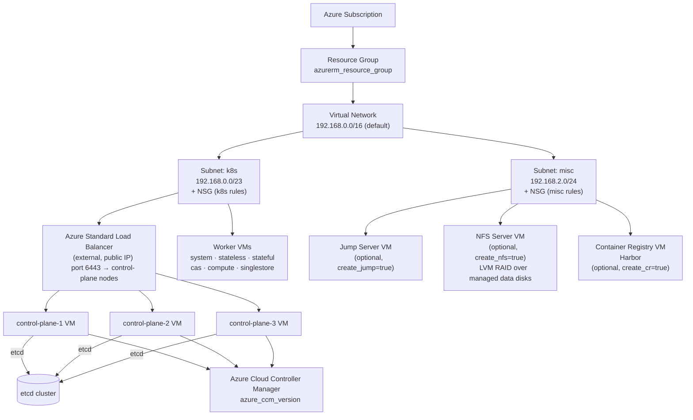
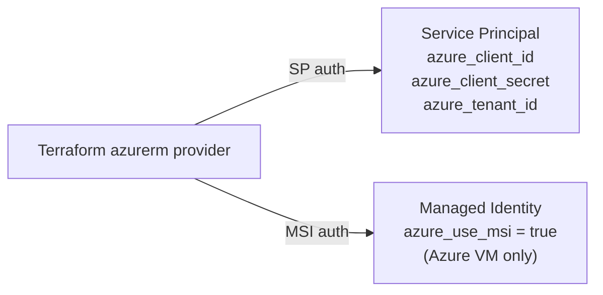

# Azure Topology Architecture

[← Architecture Overview](overview.md) | [Deployment Guide →](../../topologies/azure/README.md)

## Resource Layout



## Networking Design

| Component | Detail |
| :--- | :--- |
| VNet | Created by Terraform, or attach to existing via `azure_vnet_name` |
| k8s subnet | All Kubernetes node NICs — control plane + workers |
| misc subnet | Jump, NFS, and container registry NICs |
| NSG rules | Auto-created (SSH, K8s API 6443, NodePort) unless `azure_create_nsg_rules = false` |
| Control-plane HA | Azure Standard Load Balancer (external) on port 6443 — **not kube-vip** |
| Service LB | kube-vip cloud provider or MetalLB — IP pool assigned via `cluster_lb_addresses` |
| Public IP | VMs optionally get public IPs (`azure_vm_public_ip_enabled`); restrict access via `azure_default_public_access_cidrs` |

## Authentication Options



## Azure-Specific Components

| Component | Variable | Notes |
| :--- | :--- | :--- |
| Azure CCM | `azure_ccm_version` = `1.33.1` | Required for `kubernetes.io/role: master` node labelling and cloud routes |
| Accelerated Networking | `azure_accelerated_networking` = `true` | Requires supported VM SKU (D/E/F series) |
| NFS LVM RAID | `nfs_data_disks` = `[256, 256]` | Managed disks striped into a single LVM volume for higher throughput |

## Script Entry Point

```bash
# Azure uses deploy.sh (not oss-k8s.sh)
export AZURE_SUBSCRIPTION_ID=...
export AZURE_TENANT_ID=...
export AZURE_CLIENT_ID=...
export AZURE_CLIENT_SECRET=...

./scripts/deploy.sh apply    --system azure --workspace /workspace --tfvars /workspace/azure.tfvars
./scripts/deploy.sh install  --system azure --workspace /workspace
./scripts/deploy.sh destroy  --system azure --workspace /workspace
```
