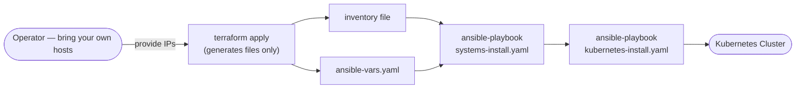
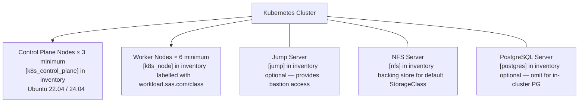
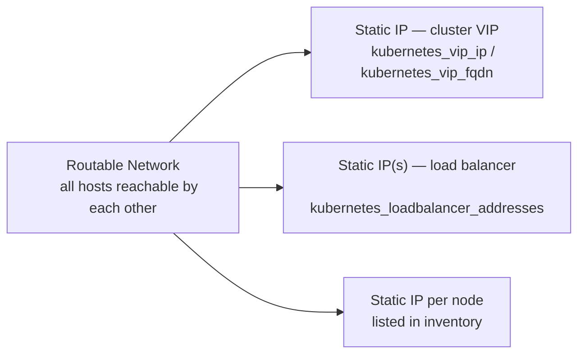

# Bare Metal Topology Architecture

[← Architecture Overview](overview.md) | [Deployment Guide →](../../topologies/bare_metal/README.md)

## Overview

The bare metal topology has **no Terraform-managed infrastructure**. You supply pre-existing physical machines or VMs. Terraform's sole role is to write the Ansible `inventory` and `ansible-vars.yaml` files from the variables you provide.



## Host Requirements Layout



## Node Roles and Recommended Resources

| Role | Inventory Group | Min Count | Recommended CPUs | Recommended Memory |
| :--- | :--- | :--- | :--- | :--- |
| Control Plane | `[k8s_control_plane]` | 3 | 4 | 8 GB |
| System | `[k8s_node]` | 1 | 4 | 8 GB |
| Stateless | `[k8s_node]` | 2 | 8 | 32 GB |
| Stateful | `[k8s_node]` | 2 | 8 | 32 GB |
| CAS | `[k8s_node]` | 2+ | 16 | 64 GB |
| Jump | `[jump]` | 1 | 2 | 4 GB |
| NFS | `[nfs]` | 1 | 4 | 8 GB |
| PostgreSQL | `[postgres]` | 0–1 | 4 | 16 GB |

## Networking Requirements



| Requirement | Detail |
| :--- | :--- |
| OS | Ubuntu 22.04 LTS or 24.04 LTS |
| User | Password-less `sudo` on all hosts |
| Network | Single routable network spanning all hosts |
| SSH | Public keys from `system_ssh_keys_dir` distributed to all hosts |
| VIP | At least 1 static IP for `kubernetes_vip_ip` |
| LB IPs | At least 1 CIDR block or IP range for `kubernetes_loadbalancer_addresses` |
| NFS disk | Sufficient storage on the NFS server for SAS Viya PVCs |
| Local disks | Empty partitions on stateful/CAS nodes for `local-storage` StorageClass |

## Inventory File Structure

```ini
# topologies/bare_metal/sample-inventory

[k8s_control_plane]
<control-plane-1-ip>
<control-plane-2-ip>
<control-plane-3-ip>

[k8s_node]
<worker-1-ip>    node_labels="workload.sas.com/class=stateless"
<worker-2-ip>    node_labels="workload.sas.com/class=stateful"
<worker-3-ip>    node_labels="workload.sas.com/class=cas"
...

[jump]
<jump-ip>

[nfs]
<nfs-ip>

[postgres]   # optional
<postgres-ip>
```

## Script Entry Point

```bash
export $(grep -v '^#' ~/.bare_metal_creds.env | xargs)

# apply writes inventory + ansible-vars.yaml only (no VM provisioning)
./scripts/oss-k8s.sh apply    --system bare_metal --workspace /workspace --tfvars /workspace/bm.tfvars
./scripts/oss-k8s.sh install  --system bare_metal --workspace /workspace
./scripts/oss-k8s.sh uninstall --system bare_metal --workspace /workspace
```
