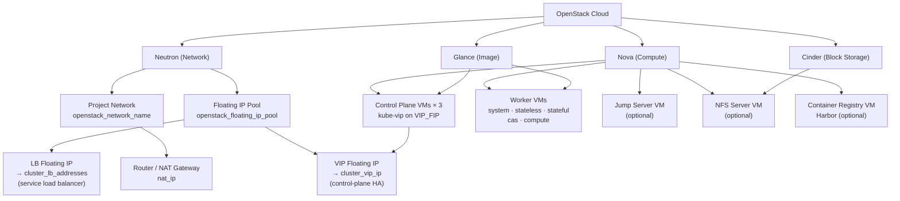
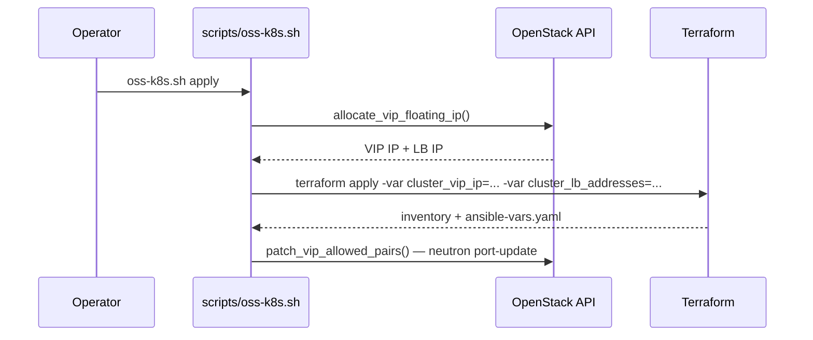
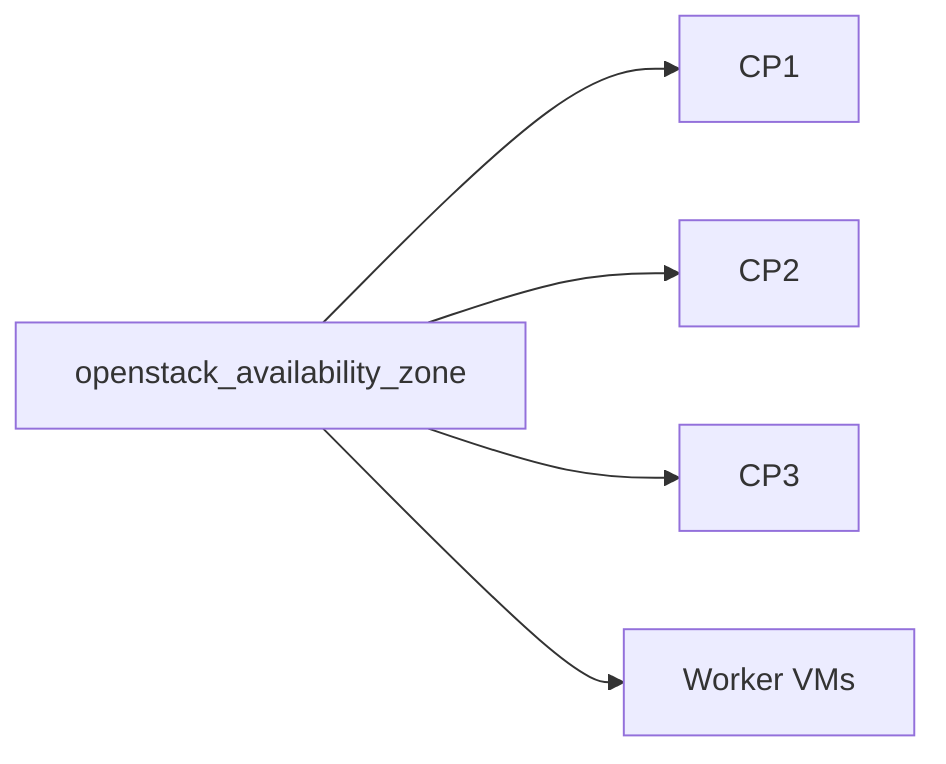

# OpenStack Topology Architecture

[← Architecture Overview](overview.md) | [Deployment Guide →](../../topologies/openstack/README.md)

## Resource Layout



## Networking Design

| Component | Detail |
| :--- | :--- |
| Network | All VMs attach to `openstack_network_name` (Neutron network) |
| Floating IPs | Pre-allocated from `openstack_floating_ip_pool` before `terraform apply` |
| Control-plane VIP | One floating IP assigned to kube-vip as the control-plane virtual IP |
| Service LB | Second floating IP + `cluster_lb_addresses` range for kube-vip cloud provider / MetalLB |
| Security groups | `openstack_security_groups` applied to every VM |
| Port allowed-address-pairs | Patched post-apply to allow kube-vip VIP traffic through Neutron port security |
| Keypair | `openstack_ssh_keypair` must exist in OpenStack before deployment |

## VIP and Floating IP Allocation Flow



## Availability Zone Placement



All VMs are placed in the same availability zone (`openstack_availability_zone`). For multi-AZ deployments, additional topology customization is needed.

## Script Entry Point

```bash
source ~/.openstack_creds.env

./scripts/oss-k8s.sh apply    --system openstack --workspace /workspace --tfvars /workspace/openstack.tfvars
./scripts/oss-k8s.sh install  --system openstack --workspace /workspace
./scripts/oss-k8s.sh destroy  --system openstack --workspace /workspace
```
