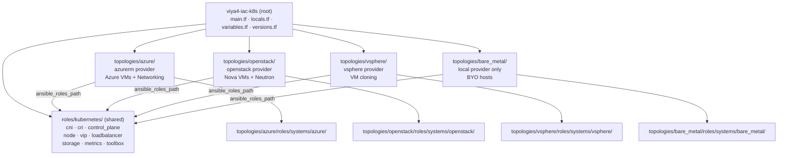
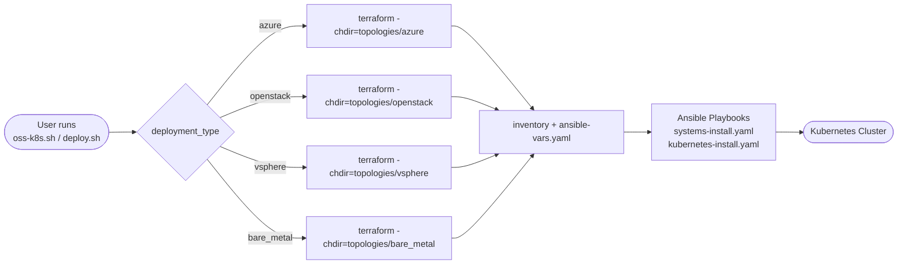
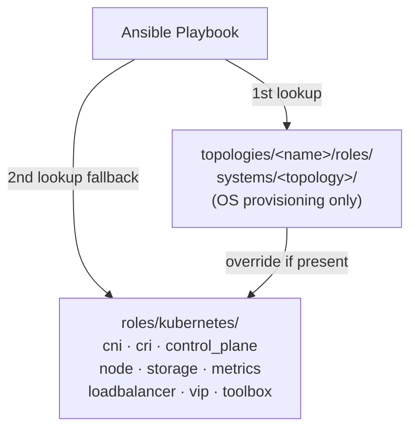
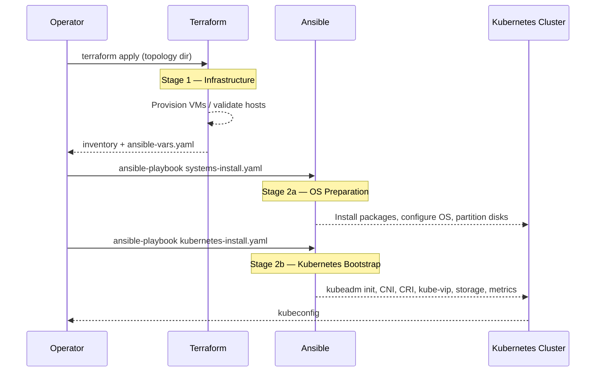
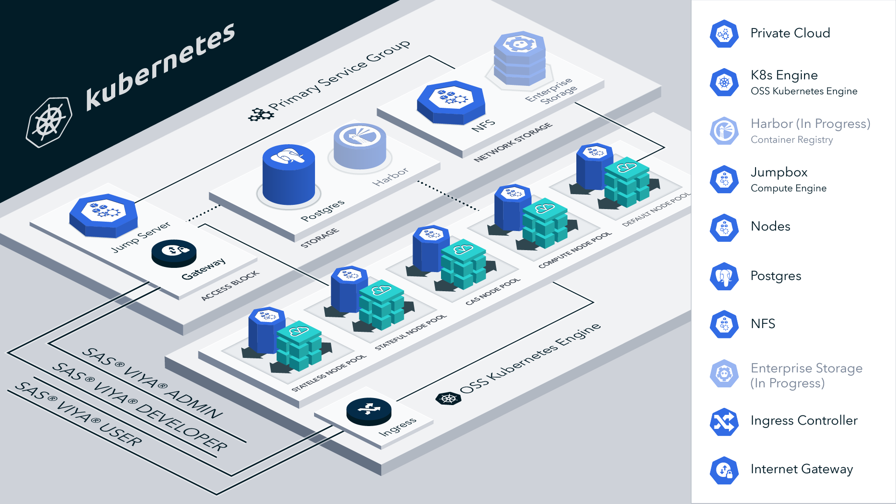
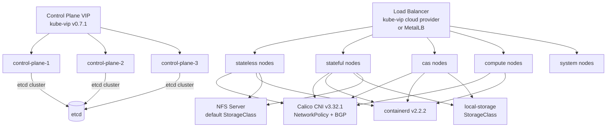

# Architecture Overview — viya4-iac-k8s

This page describes the overall architecture of the `viya4-iac-k8s` multi-topology platform.
For topology-specific layouts see the linked pages below.

## Table of Contents

- [Repository Architecture](#repository-architecture)
- [Topology Dispatch Model](#topology-dispatch-model)
- [Ansible Role Resolution](#ansible-role-resolution)
- [Two-Stage Deployment Pipeline](#two-stage-deployment-pipeline)
- [Topology-Specific Architectures](#topology-specific-architectures)
- [Cluster Architecture (Common)](#cluster-architecture-common)
- [Runtime Workspace Isolation](#runtime-workspace-isolation)

---

## Repository Architecture



---

## Topology Dispatch Model

The entry-point scripts bypass the root module and run Terraform directly inside the chosen topology directory. The root `main.tf` exists for reference and IDE navigation only.



> **Note:** The bare metal `apply` phase is a no-op for VM provisioning. It only writes the inventory and `ansible-vars.yaml` files from existing host information.

---

## Ansible Role Resolution

Topology-specific OS roles and shared Kubernetes roles coexist via a dual `roles_path` in `ansible.cfg`:

```
roles_path = ./roles:../../roles
```



A topology can override any shared role by placing a same-named role in `topologies/<name>/roles/`. No changes to shared code are needed.

---

## Two-Stage Deployment Pipeline



---

## Topology-Specific Architectures

| Topology | Infrastructure | Provisioning | Guide |
| :--- | :--- | :--- | :--- |
| **Azure** | Azure VMs, VNet, NSG, Load Balancer | Terraform (azurerm) | [azure.md](azure.md) |
| **OpenStack** | Nova VMs, Neutron networking, Floating IPs | Terraform (openstack) | [openstack.md](openstack.md) |
| **vSphere** | VM clones from template | Terraform (vsphere) | [vsphere.md](vsphere.md) |
| **Bare Metal** | Pre-existing hosts (BYO) | None — Ansible only | [bare-metal.md](bare-metal.md) |

---

## Cluster Architecture (Common)

All four topologies produce a Kubernetes cluster with this internal architecture:

[](../images/viya4-iac-k8s-diag.png?raw=true)



**Kubernetes components installed on all topologies:**

| Component | Version | Purpose |
| :--- | :--- | :--- |
| kubeadm / kubelet / kubectl | per `cluster_version` | Cluster bootstrap and management |
| containerd | `2.2.2` | Container runtime |
| Calico | `3.32.1` | CNI — pod networking and NetworkPolicy |
| kube-vip | `0.7.1` | Control-plane virtual IP |
| kube-vip cloud provider | `v0.0.8` | Service LoadBalancer (kube-vip mode) |
| MetalLB | `0.14.3` | Service LoadBalancer (metallb mode) |
| NFS CSI Driver | `4.13.3` | Default storage class (NFS-backed) |
| sig-storage-local-static-provisioner | `2.8.0` | `local-storage` storage class |
| metrics-server | `3.13.0` | Pod/node resource metrics |
| Helm | `3.14.4` | Chart deployment |

---

## Runtime Workspace Isolation

Each cluster deployment is isolated in its own workspace directory. Multiple clusters can be deployed concurrently from the same bind-mounted workspace without state conflicts.

```
/workspace/
├── <prefix>-azure/
│   ├── terraform.tfvars      ← operator input
│   ├── terraform.tfstate     ← Terraform state
│   ├── inventory             ← generated
│   ├── ansible-vars.yaml     ← generated
│   ├── kubeconfig            ← generated post-install
│   └── logs/
│       ├── apply-<timestamp>.log
│       └── install-<timestamp>.log
│
├── <prefix>-openstack/       ← independent — safe to run in parallel
├── <prefix>-vsphere/
└── <prefix>-bare-metal/
```
