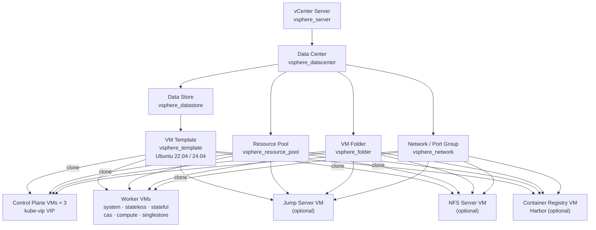
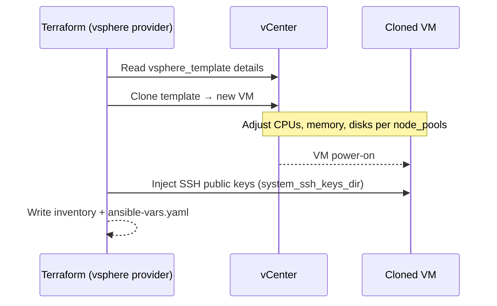
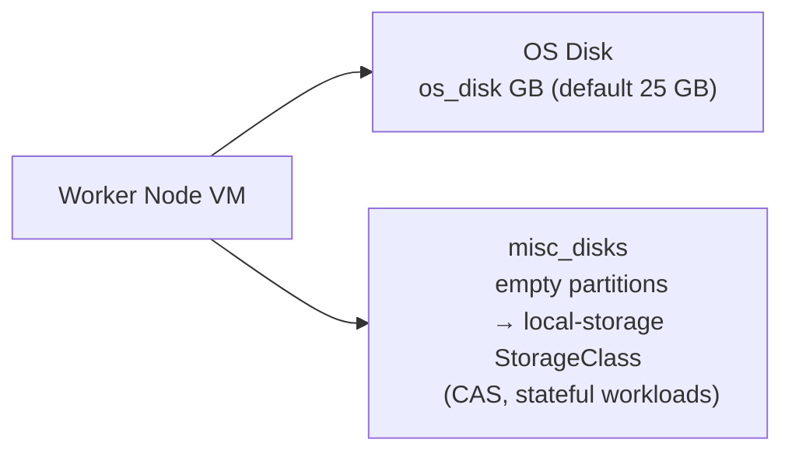

# VMware vSphere Topology Architecture

[← Architecture Overview](overview.md) | [Deployment Guide →](../../topologies/vsphere/README.md)

## Resource Layout



## Networking Design

| Component | Detail |
| :--- | :--- |
| Network | All VMs attach to a single vSphere port group (`vsphere_network`) |
| IP assignment | Static IPs via `ip_addresses` list per pool, or dynamic count-based |
| Gateway | Defined via `gateway` variable — applied to all VM network adapters |
| Netmask | `netmask` (prefix length, default `16`) |
| DNS | `dns_servers` list |
| Control-plane VIP | kube-vip running as a static pod on each control-plane node |
| Service LB | kube-vip cloud provider or MetalLB on `cluster_lb_addresses` range |

## VM Clone Workflow



## Disk Layout



`misc_disks` is a list of additional disk sizes. Each disk is an empty partition created and attached to the VM. These are formatted and provisioned as `local-storage` persistent volumes by sig-storage-local-static-provisioner.

## Template Requirements

| Requirement | Value |
| :--- | :--- |
| OS | Ubuntu 22.04 LTS or 24.04 LTS |
| Min CPUs | 2 |
| Min memory | 4 GB |
| Min disk | 25 GB (thin provisioned) |
| Root filesystem | mounted at `/dev/sda2` |
| User | Default user with password-less `sudo` |

> These values are the minimum starting point. Terraform adjusts them per the node pool definitions.

## Script Entry Point

```bash
export $(grep -v '^#' ~/.vsphere_creds.env | xargs)

./scripts/oss-k8s.sh apply    --system vsphere --workspace /workspace --tfvars /workspace/vsphere.tfvars
./scripts/oss-k8s.sh install  --system vsphere --workspace /workspace
./scripts/oss-k8s.sh destroy  --system vsphere --workspace /workspace
```
